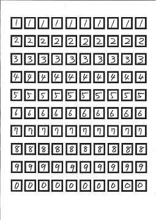
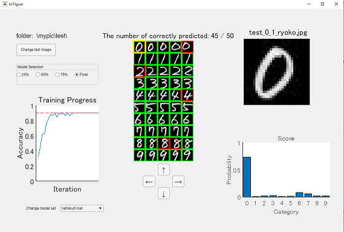

# 手書き数字認識によるAI体験


Copyright 2020 The MathWorks, Inc.


# Introduction


このサンプルは、手書きの数字を学習データとして用い、畳み込みニューラルネットワーク (CNN) による画像分類を行います。金沢工業大学との共同開発により作成されました。授業中に学生が書いた数字を用いて、学習データの拡張による精度向上の体験や、App Designer で作成したCNN 学習過程を可視化する GUIの 利用により、AI を身近に感じながらより実践的な知識を習得できます。


# Workflow
## Step 1: 学習データの準備
### Step1-1


[教員] template.pdfを印刷し、学生に配布


[学生] 印刷されたワークシート上に、下記のように0-9までの数字を記入する





### Step1-2


[教員] 学生が書いたワークシートをスキャンし、画像として保存（ここでは例として1.jpgとする）


  
## Step2: 手書き文字から学習用データの作成


以下のコードを実行し、GUI上で名前（アルファベットで）を入力し、OKをおす。


```matlab:Code
myimportnumber2_0
```


このコードは下のシートから数字を切り取り、テスト用・評価用に分けて、数字毎のフォルダーに保存する。


  
### Step3: 学習とその可視化


学習過程を可視化しながら学習を行う。


```matlab:Code
myhandwrittentrain_visualization2_0
```


(左図) それぞれのテスト画像。緑枠は予測が正しいことを示し、赤枠は正しく予測されていないことを示す。  


(右図) 学習曲線


受講者が学習過程を理解するために、学習が完了したときと、精度が25%,50%,75%のときのモデルとそれぞれの学習曲線を、netresults.matとして保存している。


  
### Step4: 学習結果の分析 

\hfill \break


```matlab:Code
myClassifierApp2_0
```


上記コードを実行することで、アプリが立ち上がる。





このアプリでは、まずテスト画像と保存したネットワークを読み込む。


GUI上では、”Model Selection”でStep3で保存した学習途中のモデルも読み込むことができ、モデルを変更することで、どのように予測が変わっていくか理解することができる。


右図は、黄枠で囲んだテストイメージの画像とそのスコアを示している。黄枠は下の矢印ボタンで移動することができる。


  
### Step5: 別のデータセットも加えて学習


Step2からStep4までは、自分で作成したデータセットを使って学習を行ったが、他の人の書いたデータを用いるとどうなるか試してみよう。


まず、自分のデータセットの名前を変更する。


```matlab:Code
movefile mypic mypic1
```


myimportnumber2_0.mの20行目を変更し、他人のワークシートを読みこむ。


```matlab:Code
myimportnumber2_0
```


二人分のデータを読み込みmypic2というフォルダを作成する


```matlab:Code
myhandwrittentrain_for2sets2_0
```


残りのワークフローはStep4と同様。


```matlab:Code
myClassifierApp2_0
```


ここで学習途中のモデルを読み込む以外にも、"Change test image"でテスト画像を変更したり、モデルセットを”Change model set”で切り替えることができる。


# System Requirements


MathWorks Products 


   -  MATLAB 
   -  Deep Learning Toolbox 
   -  Image Processing Toolbox 
   -  Computer Vision Toolbox 

# Acknowledgement


We thank Dr. Shinichi Taniguchi, Prof. Akira Nakamura and Dr. Tomoshige Kudo for their valuable proposals and discussion that greatly improved this sample code. We would also like to show our gratitude to Kanazawa Institute of Technology for their agreement to publish this code.


